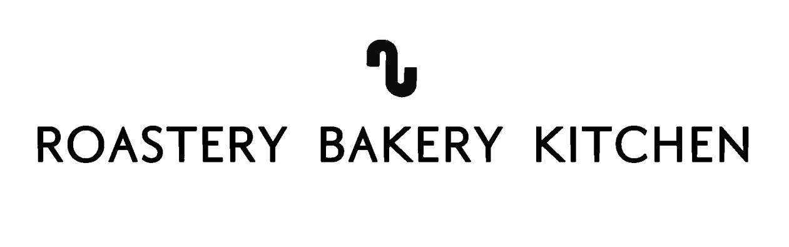

<!--зависимости-->
# CoffeeWebApp_project

 
 
   

Project VMO-11. 4 group

## Info
Educational Project.  
A web application for the 8th building coffee shop. It was created to solve the problem of queues during breaks. Allows you to order coffee and other items from the menu in advance. A queue system has been thought out to evenly distribute the workload.
## Dependencies
```express ^4.21.0```, ```sqlite3 5.1.7``` или выше.

## How to start
1. Clone repo
  ```bash
  git clone https://github.com/immxrtalbeast/CoffeeWebApp_PROJECT.git
  ```
2. Install dependencies
  ```javascript
   npm install
  ```
3. Server launch
  ```javascript
   npm start
  ```
4. Open project on localhost  
  ```bash
    http://localhost:3000
  ```
